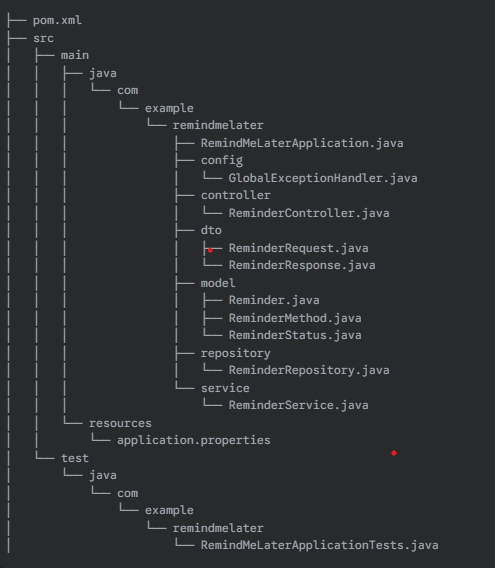

# Remind-me-later API

---

## Project Overview

This project implements the backend API for a "Remind-me-later" application. The core functionality allows users to schedule reminders with a specific message, date, time, and preferred reminder method (**SMS** or **Email**). The API is designed to persist this reminder information in a database and, crucially, to push due reminders to connected clients in real-time using **Server-Sent Events (SSE)**.

I've implemented this project using **Java** and the **Spring Boot** framework, leveraging an **H2 in-memory database** for simplicity and ease of setup.

---

## Features

* **Create Reminder:** An endpoint to submit new reminder requests with details like `reminderDateTime`, `message`, and `reminderMethod`.
* **View All Reminders:** An endpoint to retrieve a list of all stored reminders.
* **View Pending Reminders:** An endpoint to retrieve a list of reminders that are still `PENDING`.
* **Real-time Due Reminders (SSE):** A dedicated SSE endpoint that allows clients to subscribe and receive notifications when a reminder becomes due.
* **Data Persistence:** Reminders are stored in an H2 in-memory database (configurable to other databases).
* **Validation:** Input validation ensures that reminder requests are well-formed (e.g., future date/time, non-blank message).
* **Scheduled Processing:** A scheduled task periodically checks for due reminders and pushes them via SSE.

---

## Technologies Used

* **Java 17:** The primary programming language.
* **Spring Boot :** Framework for building robust, stand-alone, production-grade Spring applications.
* **Spring Data JPA:** For database interaction and object-relational mapping.
* **H2 Database:** An in-memory relational database used for development and testing.
* **Lombok:** Reduces boilerplate code (getters, setters, constructors).
* **Maven:** Dependency management and build automation tool.
* **Server-Sent Events (SSE):** For real-time, one-way communication from server to client.

---

## API Endpoints

**Postman Collection:** [https://documenter.getpostman.com/view/42768741/2sB2qcBKxv](https://documenter.getpostman.com/view/42768741/2sB2qcBKxv)

The API is exposed under the `/api/reminders` base path.

### 1. Create a New Reminder

* **URL:** `POST /api/reminders`
* **Content-Type:** `application/json`
* **Request Body Example:**

    ```json
    {
      "reminderDateTime": "2025-05-25T10:30:00",
      "message": "Don't forget to attend the meeting!",
      "reminderMethod": "EMAIL"     # or   "SMS"
    }
    ```
* **Success Response (201 Created):**

    ```json
    {
      "id": 1,
      "reminderDateTime": "2025-05-25T10:30:00",
      "message": "Don't forget to attend the meeting!",
      "reminderMethod": "EMAIL",
      "status": "PENDING",
      "createdAt": "2025-05-24T14:45:00.123456",
      "updatedAt": "2025-05-24T14:45:00.123456"
    }
    ```
* **Error Response (400 Bad Request):** If validation fails.

    ```json
    {
      "message": "Validation failed",
      "errors": {
        "reminderDateTime": "Reminder date and time must be in the present or future"
      }
    }
    ```

### 2. Get All Reminders

* **URL:** `GET /api/reminders`
* **Success Response (200 OK):**

    ```json
    [
      {
        "id": 1,
        "reminderDateTime": "2025-05-25T10:30:00",
        "message": "Don't forget to attend the meeting!",
        "reminderMethod": "EMAIL",
        "status": "PENDING",
        "createdAt": "2025-05-24T14:45:00.123456",
        "updatedAt": "2025-05-24T14:45:00.123456"
      },
      // ... more reminders
    ]
    ```

### 3. Get Pending Reminders

* **URL:** `GET /api/reminders/pending`
* **Success Response (200 OK):**

    ```json
    [
      {
        "id": 1,
        "reminderDateTime": "2025-05-25T10:30:00",
        "message": "Don't forget to attend the meeting!",
        "reminderMethod": "EMAIL",
        "status": "PENDING",
        "createdAt": "2025-05-24T14:45:00.123456",
        "updatedAt": "2025-05-24T14:45:00.123456"
      },
      // ... more pending reminders
    ]
    ```

### 4. Stream Due Reminders (Server-Sent Events)

* **URL:** `GET /api/reminders/stream`
* **Content-Type:** `text/event-stream`
* **Description:** This endpoint keeps an open connection and pushes `reminder-due` events to the client when a reminder's `reminderDateTime` is reached and its status is `PENDING`. The reminder's status is then updated to `SENT`.
* **Event Format:**

    ```
    event: connection
    data: SSE Connection Established

    event: reminder-due
    id: 1
    data: {"id":1,"reminderDateTime":"2025-05-24T14:46:00","message":"Time for your break!","reminderMethod":"SMS","status":"PENDING","createdAt":"2025-05-24T14:45:00.123456","updatedAt":"2025-05-24T14:45:00.123456"}
    ```
  (Note: The `status` in the `data` field will be `PENDING` when the event is sent, but the database record will be updated to `SENT` immediately after sending.)

---

## Setup and Running

1.  **Clone the Repository:**

    ```bash
    git clone [https://github.com/TusharTalmale/remind-me-later-api-java.git](https://github.com/TusharTalmale/remind-me-later-api-java.git)
    cd remind-me-later-api-java
    ```
2.  **Build the Project:**

    ```bash
    mvn clean install
    ```
3.  **Run the Application:**

    ```bash
    mvn spring-boot:run
    ```
    The application will start on `http://localhost:8080`.

---

## H2 Database Console

You can access the H2 database console to inspect the data:

* **URL:** `http://localhost:8080/h2-console`
* **JDBC URL:** `jdbc:h2:mem:remindersdb`
* **Username:** `sa`
* **Password:** (No password required)

---

## How to Test SSE

You can test the SSE endpoint using various methods:

### Using `curl` (basic)

Open your terminal and run:

```bash
curl -N http://localhost:8080/api/reminders/stream
```
---
### Project Structure 

